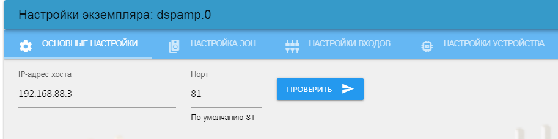
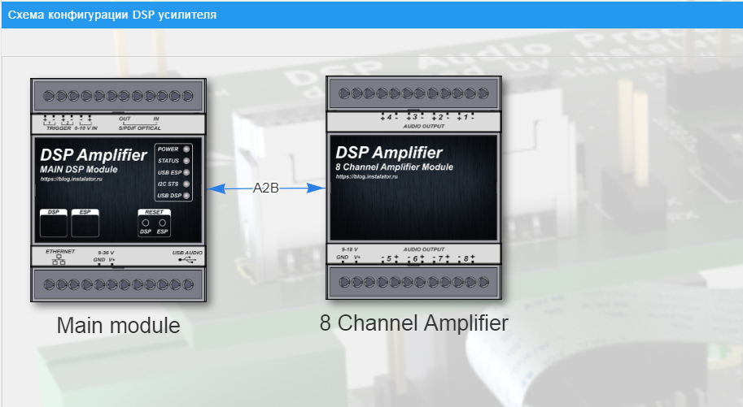
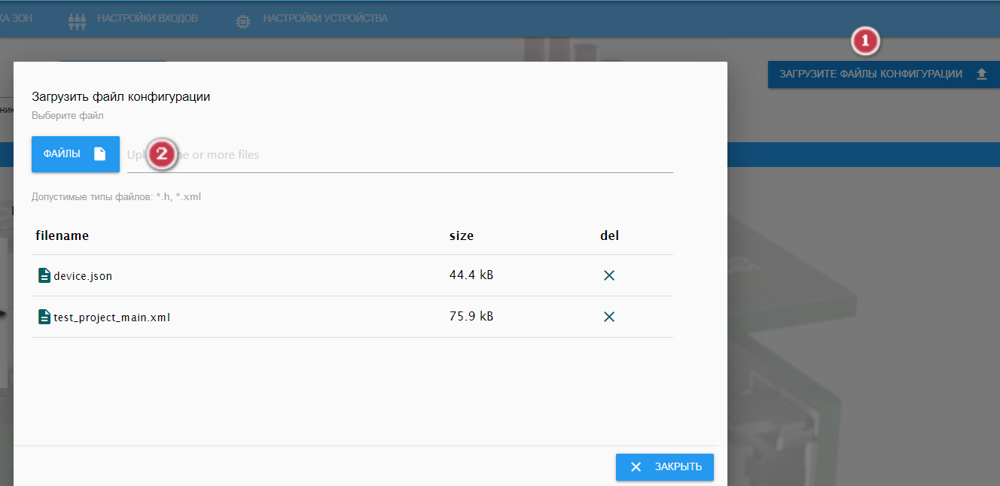
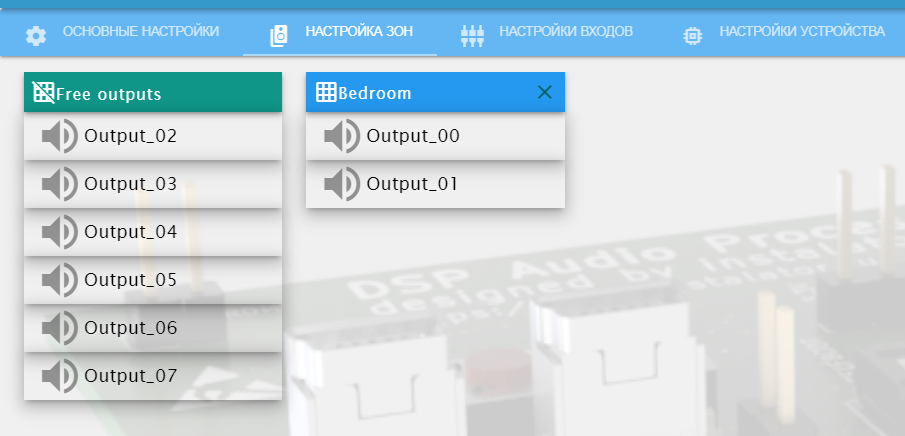
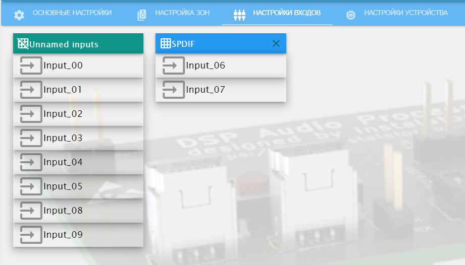
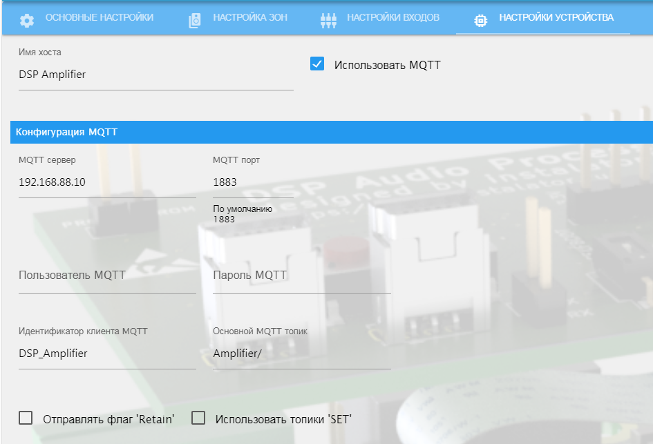
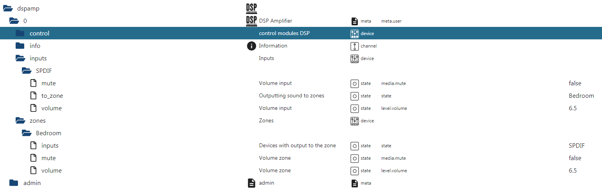
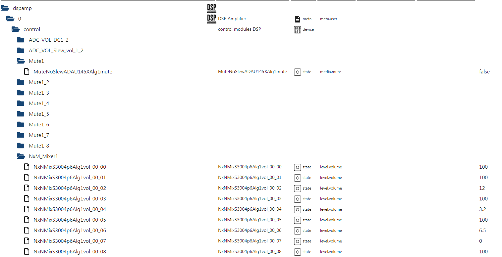

# ioBroker.dspamp

## dspamp adapter for ioBroker

DSP zone amplifier control by instalator

[Страница проекта](https://blog.instalator.ru/archives/category/dsp-%d1%83%d1%81%d0%b8%d0%bb%d0%b8%d1%82%d0%b5%d0%bb%d1%8c)

[Установка и настройка адаптера](https://blog.instalator.ru/archives/3518)

Адаптер позволяет управлять зонным усилителем чере ваш ioBroker.
Поддерживается управление всеми модулями проекта SigmaStudio и опрос их состояний. 

### Конфигурация

 - После установки адаптера необходимо его запустить, если не запустился автоматически.
 - Открыть настройки адаптера, указать IP адрес и порт WebSocket (По умолчанию порт 81) и нажать кнопку "Проверить", адаптер опросит усилитель и выведет карту модключенных модулей.

 - Загрузить XML файл проекта SigmaStudio

 - Создать зоны и распределить свободные аудио выходы

 - Создать групппы входов и распределить свободные аудио входы

- При необходимости через адаптер можно изменить настройки самого усилителя 

- После сохранения настроек адаптер создаст обьекты для управления усилителем и зонами.

### Использование

Для направления аудиосигнала на нужные зоны необходимо записать в обьект `dspamp.0.inputs.SPDIF.to_zone` имя желаемых зон, если вход необходимо распределить на несколько зон, то зоны указываются через запятую.
При этом в обьекте `dspamp.0.zones.Bedroom.inputs` зон будут отображаться входы которые активны на текущий момент для данной зоны. 

Для управления и получения состояний модулей проекта SigmaStudio используется ветка обьектов `control`. Состояния регулировки громкости преобразованы в процентный вид от 0 до 100.

### TODO

- Режим адаптера в качестве моста sigma TCP/IP
- Загрузка проекта SigmaStudio на DSP
- Пресеты проектов для загрузки по кнопке
- Виджеты для VIS
- Статусы и управление триггерами
- Выбор наименования основного NxNMixer (select)
- Бэкап файла девайс

## Changelog

### 0.0.1
* (instalator) initial release

## License
MIT License

Copyright (c) 2021 instalator <vvvalt@mail.ru>

Permission is hereby granted, free of charge, to any person obtaining a copy
of this software and associated documentation files (the "Software"), to deal
in the Software without restriction, including without limitation the rights
to use, copy, modify, merge, publish, distribute, sublicense, and/or sell
copies of the Software, and to permit persons to whom the Software is
furnished to do so, subject to the following conditions:

The above copyright notice and this permission notice shall be included in all
copies or substantial portions of the Software.

THE SOFTWARE IS PROVIDED "AS IS", WITHOUT WARRANTY OF ANY KIND, EXPRESS OR
IMPLIED, INCLUDING BUT NOT LIMITED TO THE WARRANTIES OF MERCHANTABILITY,
FITNESS FOR A PARTICULAR PURPOSE AND NONINFRINGEMENT. IN NO EVENT SHALL THE
AUTHORS OR COPYRIGHT HOLDERS BE LIABLE FOR ANY CLAIM, DAMAGES OR OTHER
LIABILITY, WHETHER IN AN ACTION OF CONTRACT, TORT OR OTHERWISE, ARISING FROM,
OUT OF OR IN CONNECTION WITH THE SOFTWARE OR THE USE OR OTHER DEALINGS IN THE
SOFTWARE.